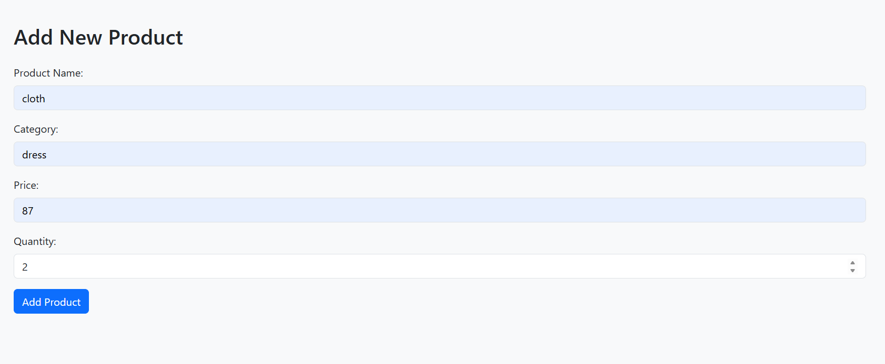

Project Purpose:
To manage product inventory, including adding new products, updating details, deleting obsolete
products, and viewing product lists. Reports include products with price above a certain amount,
products in a specific category, and top-selling products.

FILE_FORMAT
```
ProductWebApp/
├── WebContent/
│ ├── index.jsp
│ ├── productadd.jsp
│ ├── productupdate.jsp
│ ├── productdelete.jsp
│ ├── productdisplay.jsp
│ ├── reports.jsp
│ ├── report_form.jsp
│ └── report_result.jsp\
```

HOME PAGE:

ADD PAGE:



DIPLAY PAGE:
  
 DELETE PAGE:

REPORT PAGE:

REPORT FORM PAGE:

REPORT RESULT PAGE:

